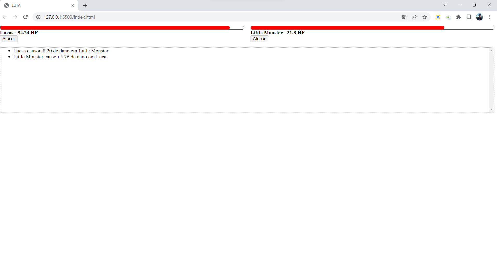

# Estudos_Request_Funcional_Classes

Repo que contém mais estudos sobre Requisições, Classes e Funcional.



O projeto LUTA tem como foco a criação de um “ringue de luta” entre personagens comuns entre os jogos de RPG.
Claro que este projeto não está focado em fazer um jogo como este, mas em pegar sua premissa e utilizá-la para incorporar os estudos de Programação Orientada a Objetos e Programação Funcional em JavaScript.

Neste "jogo", o ringue possui dois personagens, seus life bar, o botão de ataque e o log da luta.

Os personagens são feitos à parte de um indivíduo comum:

OOP ->
```markdown 
    class Character {
        _life = 1;
        maxLife = 1;
        attack = 0;
        defense = 0;

        constructor(name){
            this.name = name;
        }

        get life(){
            return this._life;
        }

        set life(newLife){
            this._life = newLife < 0 ? 0 : newLife;
        }
}
 ```

PF -> 
```markdown 
const defaultCharacter = {
    name: "",
    life: 1,
    maxLife: 1,
    attack: 0,
    defense: 0
}
```

Os personagens desse “jogo” herdam as características do indivíduo comum e em seguida têm suas características individuais preservadas.


Por exemplo:

OOP ->
```markdown 
class Knight extends Character {
    constructor(name){
        super(name);
        this.life = 100;
        this.attack = 10;
        this.defense = 8;
        this.maxLife = this.life;
    }
}
```

PF ->
```markdown 
const createKnight = (name) => {
    return {
        ...defaultCharacter,
        name,
        life: 100,
        maxLife: 100,
        attack: 10,
        defense: 8
    }
}
```

A luta entre os personagens e a dinâmica do ringue são modeladas pela função de palco.
Tem a dinâmica do golpe, defesa e dano.

Já a função log é responsável por imprimir os resultados e toda a dinâmica.